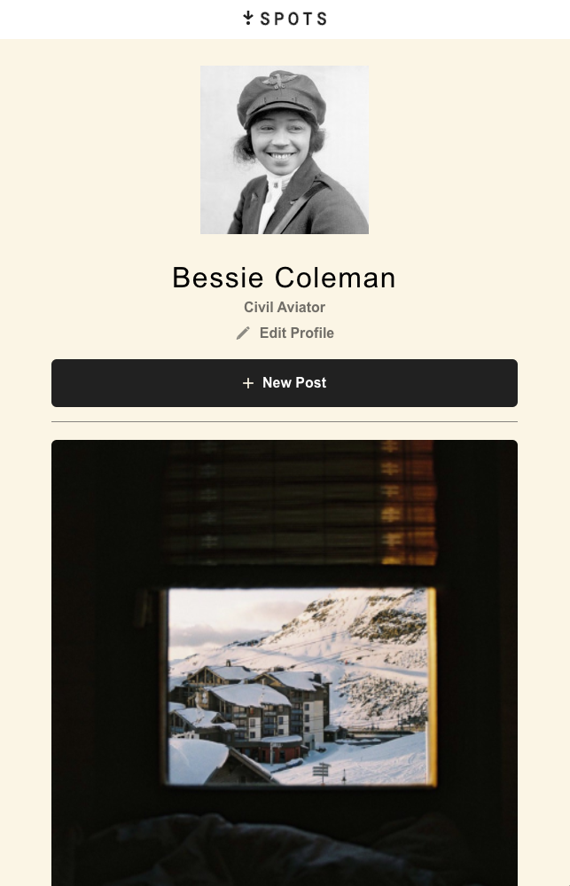
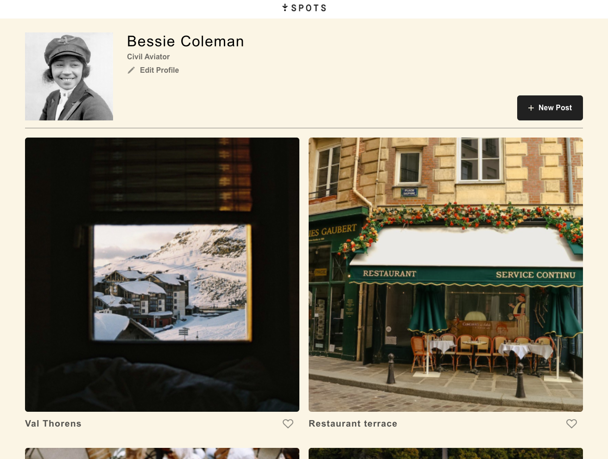
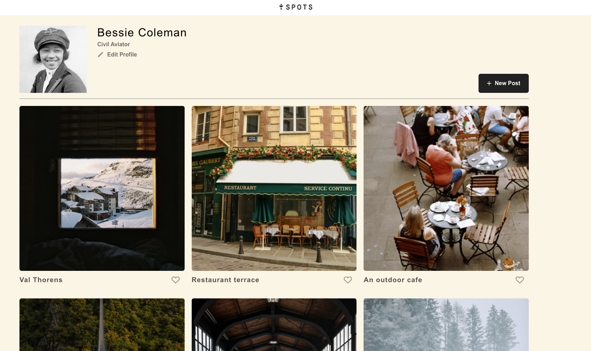
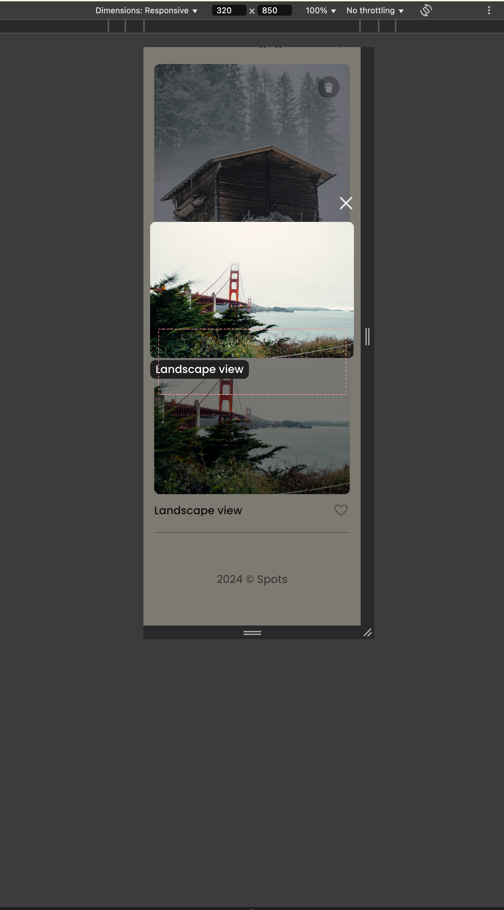
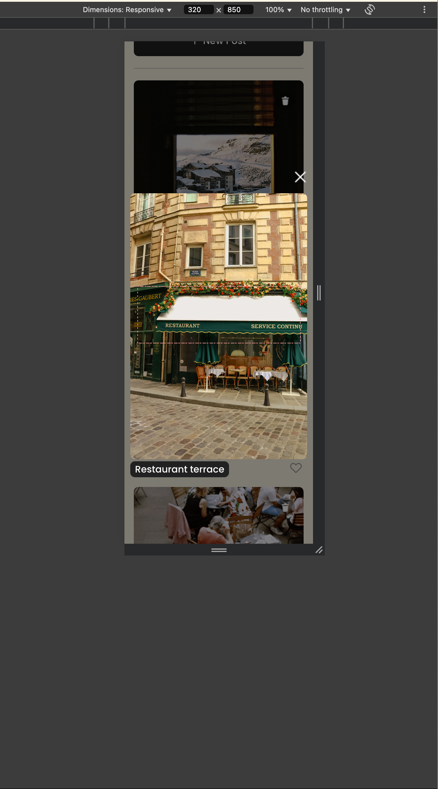

# Project 6: Spots

### Overview

- Intro
- Figma
- Images

**Intro**

This project is made so all the elements are displayed correctly on popular screen sizes. We recommend investing more time in completing this project, since it's more difficult than previous ones.  
This project is made as a mockup profile page for social purposes. Users can add new posts, like, and edit their profile. It is a responsive page for multiple device sizes.

I've split up the validation into 3 files, one for the mobile, desktop and base rules. This allows the growth
of the modals with the error messages to work uniquely. The seperation of the files allows for no overlap or overwriting complications of
the validation rules.

Link: https://tsri-code.github.io/se_project_spots/

Video: https://drive.google.com/file/d/1Fbw6yX7MITJukJTgeuemsldq-TlIN-LP/view?usp=sharing

**Figma**

- [Link to the project on Figma](https://www.figma.com/design/jFtXsDr4XOyebKcgjyXN6W/Sprint-6-Project%3A-Spots?node-id=2403-849&t=hYD9h0SmB6untl7Z-0)

**Images**

**NOTES**

- Addressing Feedback -- I haven't changed any code for the mobile image modal and the reviewer said there is no close button for the modal. I have tested on 4 seperate browsers and I can still see the close button, not sure if it was a glitch.

The way you'll do this at work is by exporting images directly from Figma — we recommend doing that to practice more. Don't forget to optimize them [here](https://tinypng.com/), so your project loads faster.

Good luck and have fun!
